# 家計簿アプリ

## 概要
日々の支出を簡単に記録・管理できる家計簿アプリです。  
ログイン後、自分の支出を登録し、一覧で確認したり、編集・削除することができます。
また、検索機能や並び替え機能により必要なデータを効率的に確認でき、月ごとの合計金額も把握できます。

---

## どんなことができるか

- ユーザー登録、ログイン、ログアウト
- 支出の登録
- 支出の一覧表示
- 登録内容の編集・更新
- 不要な支出の削除
- 検索機能（年月・日付・カテゴリで絞り込み）
- 並び替え機能（新しい順・古い順）
- 不要な支出の削除
- 月ごとの合計金額の表示

---

## 使い方（流れ）

1. ユーザーの新規登録
2. 登録が完了したら、ログイン画面からログインします
3. 支出を新しく登録
4. 一覧画面で内容を確認
5. 必要に応じて編集・削除

---

## 画面イメージ

### 新規登録画面

### ログイン画面

### 一覧画面
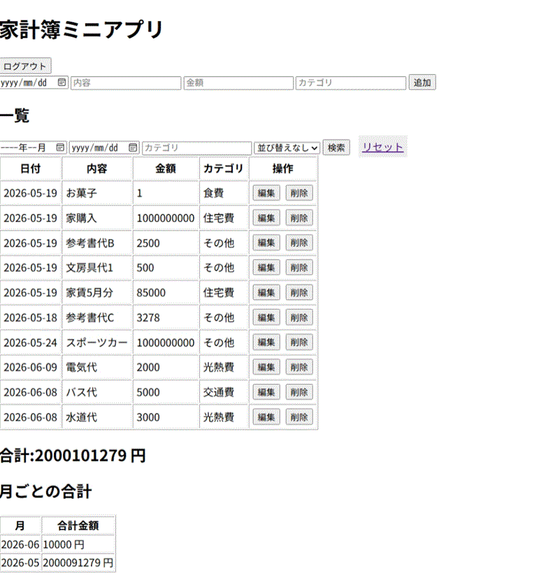

### 一覧画面_追加入力時
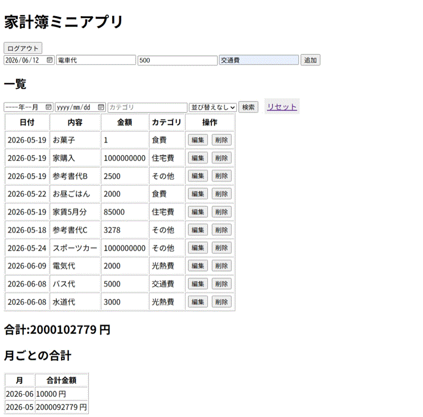

### 一覧画面_追加入力後
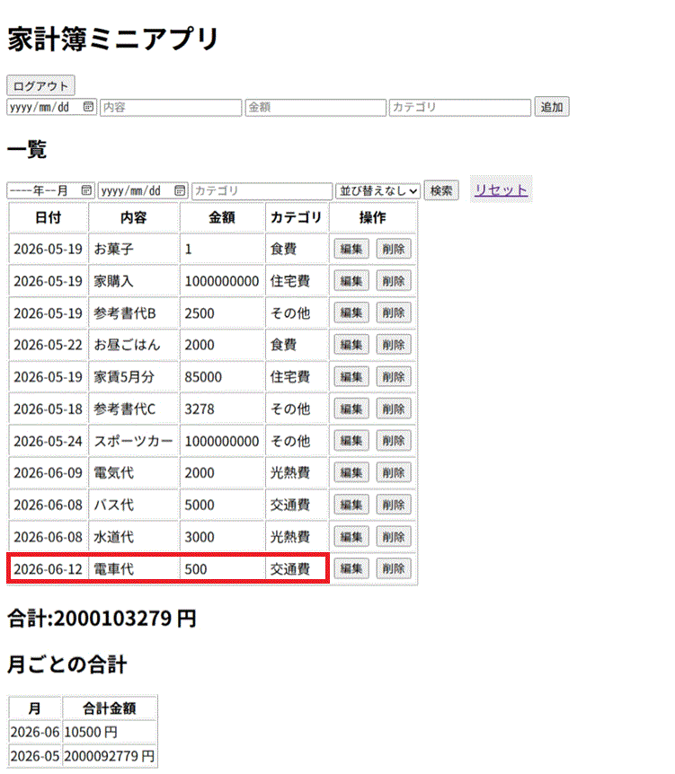

### 支出編集画面（編集ボタン押下後）
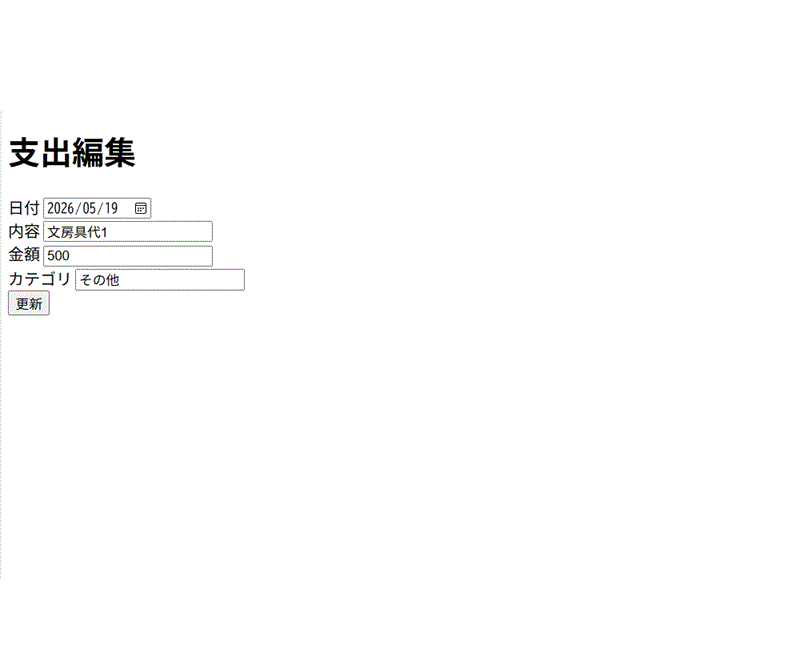

### 支出編集画面（更新ボタン押下）
_更新ボタン押下2.gif)

### 一覧画面_支出編集画面(日時・内容・金額を変更)_更新ボタン押下後
_更新ボタン押下後2.gif)

### 一覧画面_削除ボタン押下
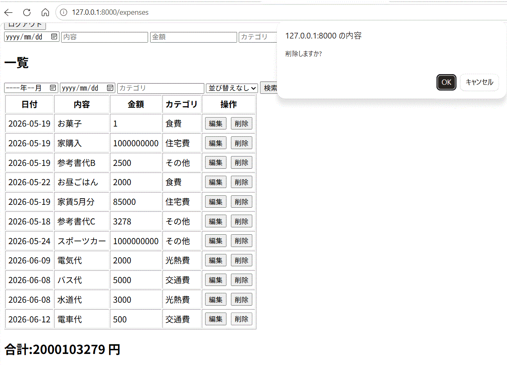

### 一覧画面_削除ボタン押下_ポップアップで削除しますか？でOKボタン押下後
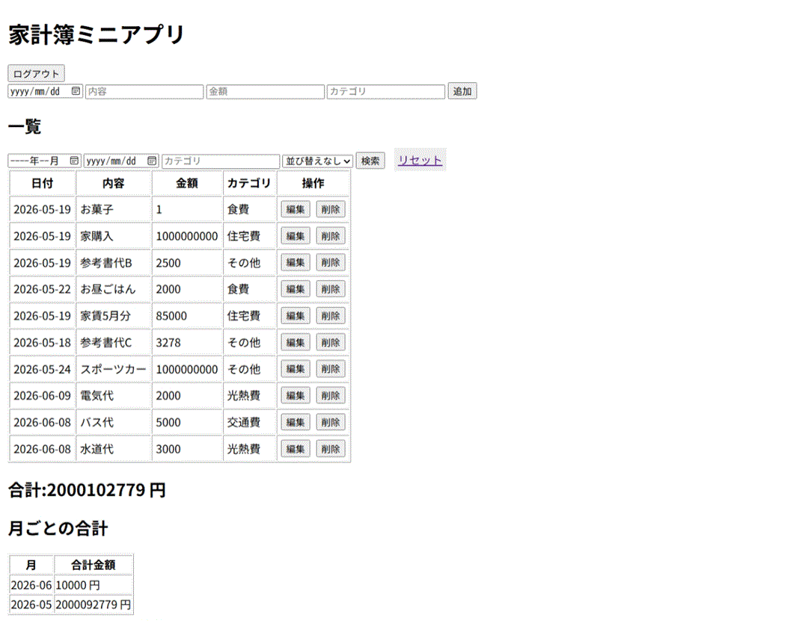

### 一覧画面_検索機能
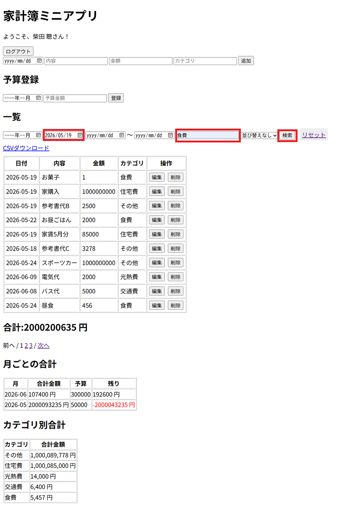

### 一覧画面_検索機能_検索ボタン押下後
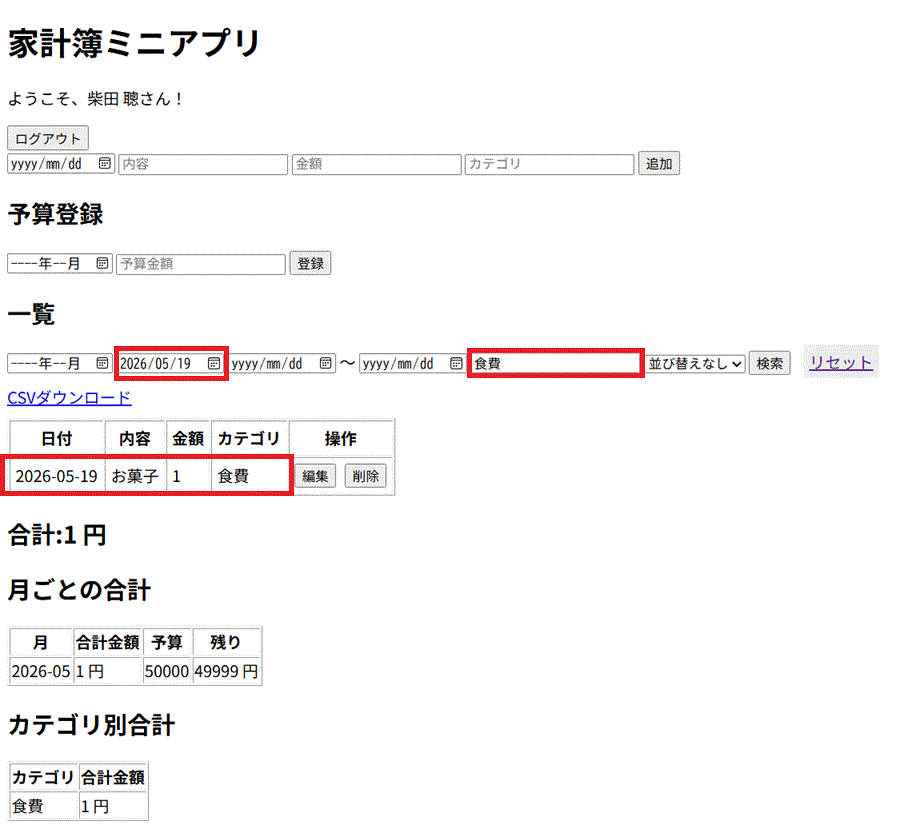

### 一覧画面_並び替え（新しい順）
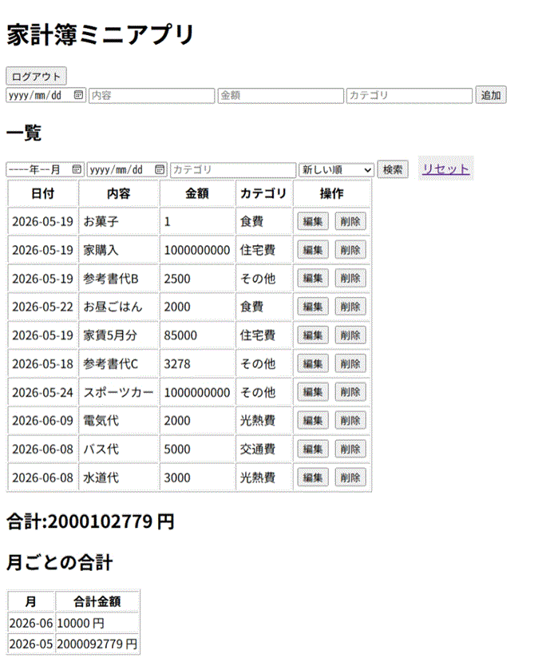

### 一覧画面_並び替え（新しい順）_選択後検索ボタン押下後

### 一覧画面_並び替え（古い順）
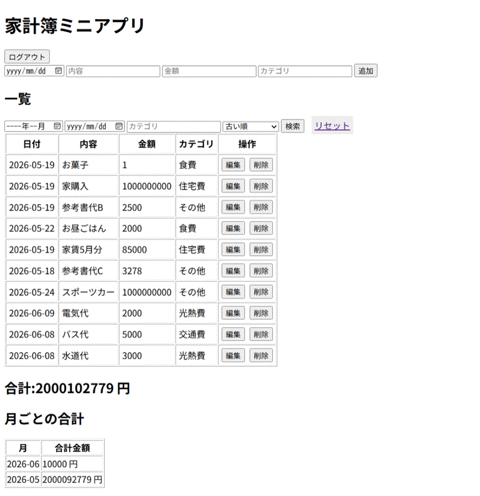

### 一覧画面_並び替え（古い順）_選択後検索ボタン押下後

### 一覧画面_リセット後
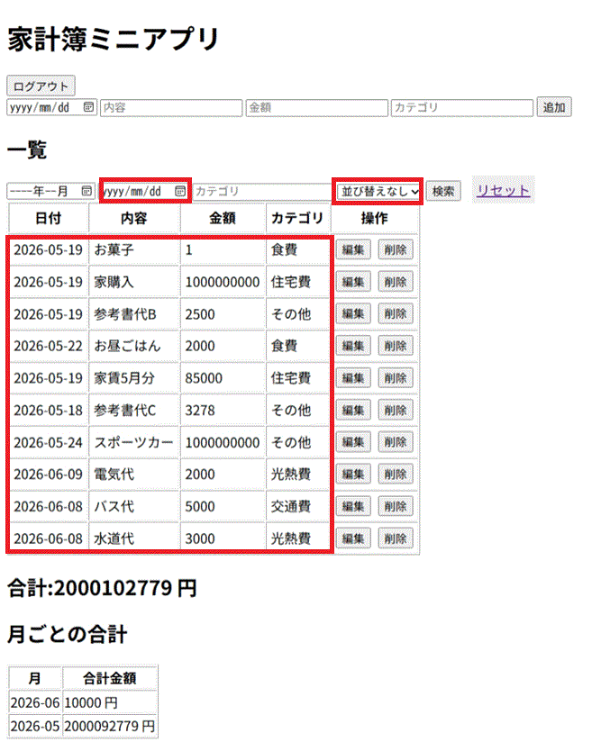

### 一覧画面_月ごとの合計
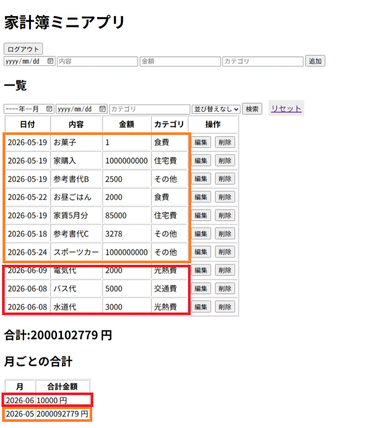
---
### ログアウトボタン押下後_ログイン画面に遷移
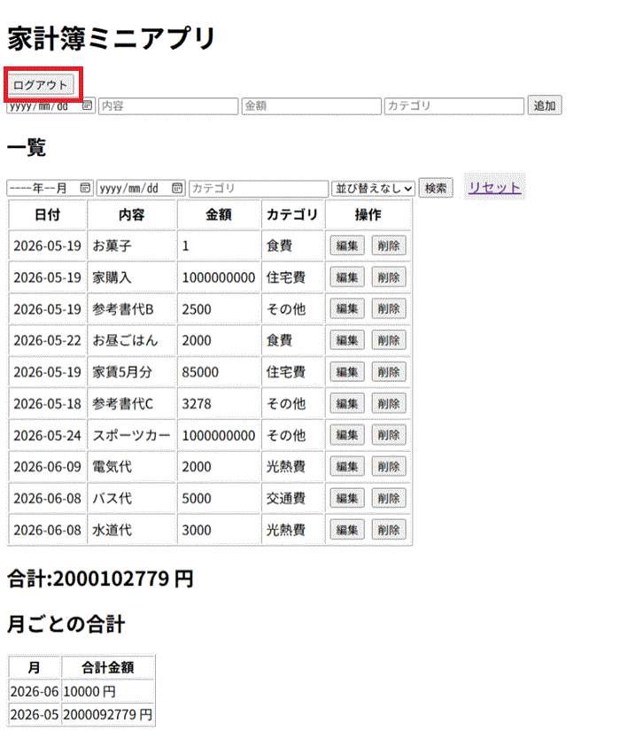
---

## 使用技術
- Laravel（PHPフレームワーク）
- PHP
- MySQL
- Blade（テンプレートエンジン）
- Vite（フロントエンドビルドツール）
---

## 動作環境
- OS:　Windows　11
- PHP:　8.2.12
- Laravel:　12.56.0
- Node.js:　24.15.0
- npm:　11.12.1
- Database:　MySQL(開発環境ではMariaDB 10.4.32を使用) 
- Web Server:　Apache 2.4.58(XAMPP)
- Frontend Build Tool:Vite 7.3.3

---

## 実装で意識した点
- 入力内容に対してバリデーションを設定し、不正な入力を防止
- 編集時に入力内容が保持されるように実装（old関数）
- ログインユーザーのみ操作できるように制御
- 検索機能では複数条件（年月・日付・カテゴリ）を組み合わせて絞り込めるように実装
- 日付検索を優先するロジックを実装し、ユーザーの意図に沿った結果を表示
- 並び替え時に同一日付でも順序が崩れないようにIDを用いて安定した並び順を実現
- 月ごとの合計はDBの集計処理（GROUP BY）を用いて効率的に取得
---

## 動作方法

以下の手順でローカル環境で動作確認ができます。

1. フロントのビルドを行います
 `npm run dev` を実行
 
2. ローカルサーバーを起動します
`php artisan serve` を実行
 
その後、
http://127.0.0.1:8000 にアクセスするとアプリが起動します。

 
