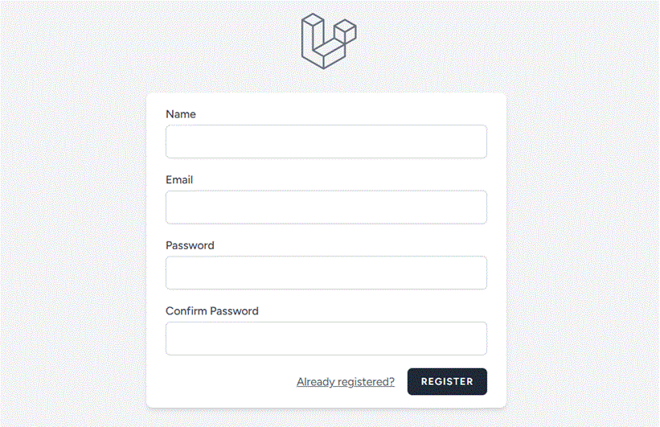
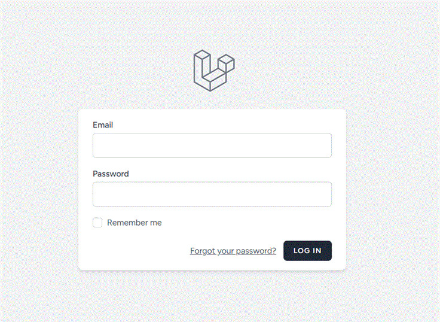
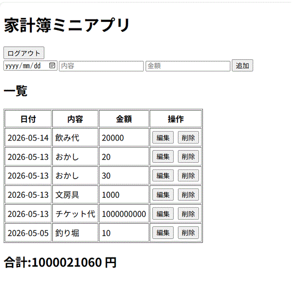
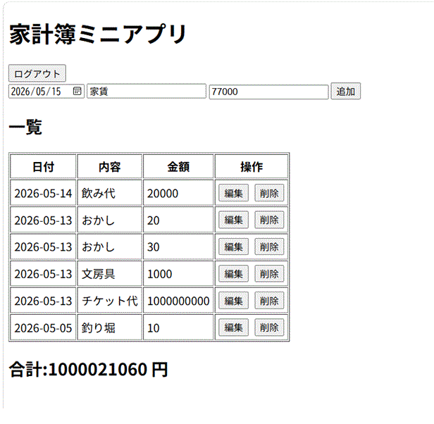
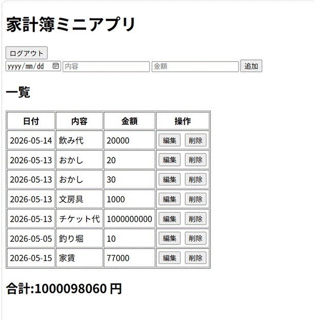
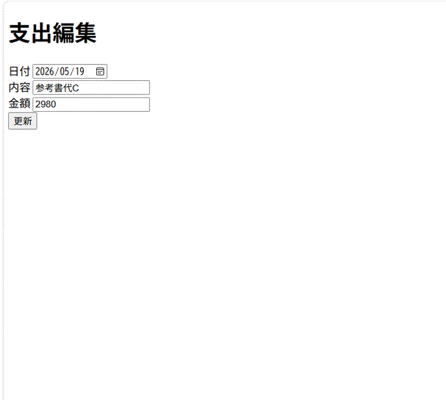
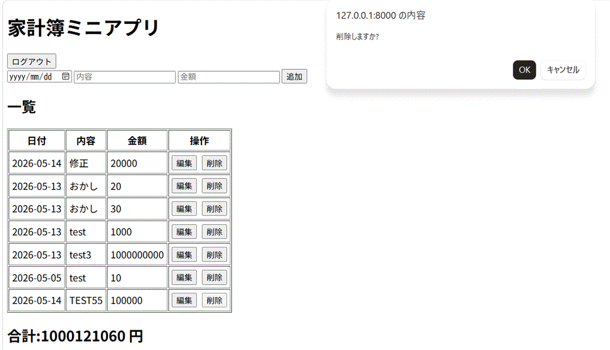
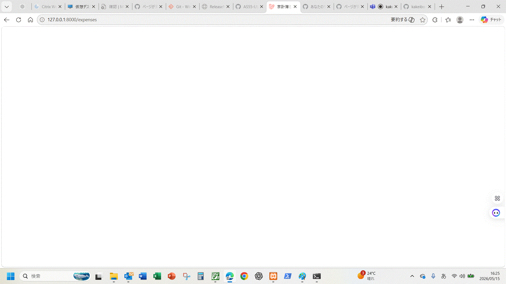

# 家計簿アプリ

## 概要
日々の支出を簡単に記録・管理できる家計簿アプリです。  
ログイン後、自分の支出を登録し、一覧で確認したり、編集・削除することができます。

---

## どんなことができるか

- ユーザー登録、ログイン、ログアウト
- 支出の登録
- 支出の一覧表示
- 登録内容の編集・更新
- 不要な支出の削除

---

## 使い方（流れ）

1. ユーザーの新規登録
2. 登録が完了したら、ログイン画面からログインします
3. 支出を新しく登録
4. 一覧画面で内容を確認
5. 必要に応じて編集・削除

---

## 画面イメージ

### 新規登録画面

### ログイン画面

### 一覧画面

### 一覧画面_追加入力時

### 一覧画面_追加入力後

### 支出編集画面（編集ボタン押下後）

### 支出編集画面（更新ボタン押下）
_更新ボタン押下.gif)

### 一覧画面_支出編集画面(日時・内容・金額を変更)_更新ボタン押下後
_更新ボタン押下後.gif)

### 一覧画面_削除ボタン押下

### 一覧画面_削除ボタン押下_ポップアップで削除しますか？でOKボタン押下後

---

## 使用技術
- Laravel
- PHP
- MySQL
- Blade

---

## 工夫した点
- 入力内容に対してバリデーションを設定し、不正な入力を防止
- 編集時に入力内容が保持されるように実装（old関数）
- ログインユーザーのみ操作できるように制御

---

## 動作方法

以下の手順でローカル環境で動作確認ができます。

1.フロントのビルドを行います
 npm run dev を実行
 
2.ローカルサーバーを起動します
php artisan serve を実行
 
その後、
http://127.0.0.1:8000 にアクセスするとアプリが起動します。

 
